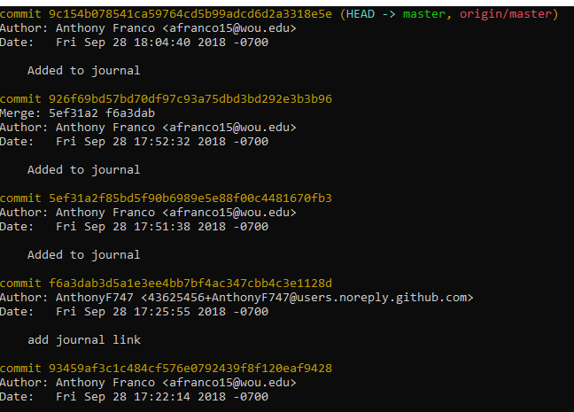
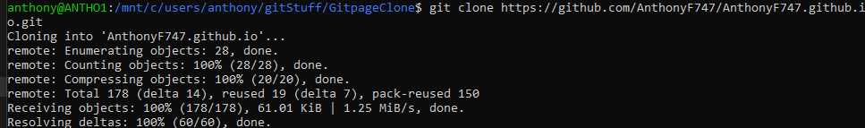
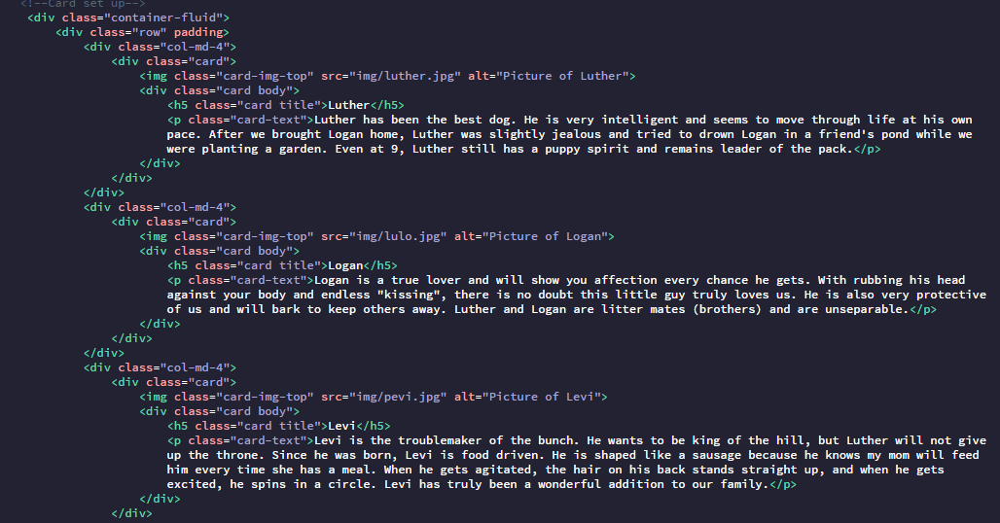
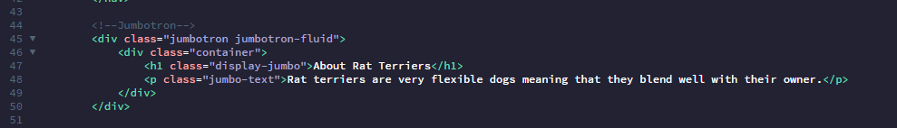
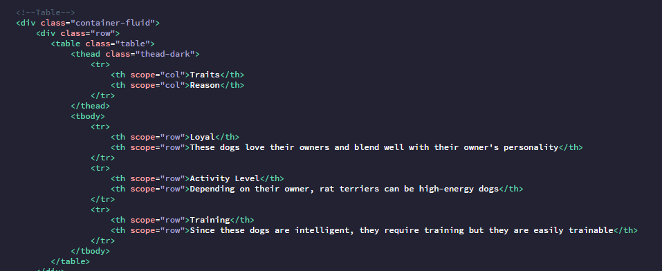
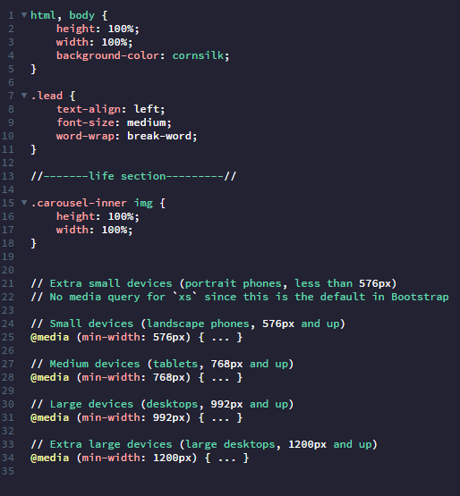
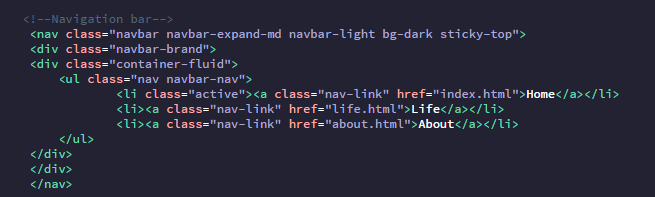

# Homework 1

Not to say this homework assignment was a slight challenge, but [GitHub](https://github.com/) really tried my patience so let's start with Git. 
There might not be pictures because I was running out of time.

## GitHub

I'm sure I did this whole thing in reverse order, but I started with the code part of the assignment. Then, before I got too far into coding, I went to GitHub to set up a new account. The sign up process was easy, but I wasn't too familiar with GitHub so I spent some time reading the basics to get me up and running. As always, the hardest part is figuring out what to call new repositories. I named my repository what I thought I was supposed to without thinking of how this whole thing was going to come together in the end. Since my first repository was where I put all my existing code and not knowing what to name it, I left that assignment in a repository by itself. I'll have to set up another repository and start adding the rest of my assignments in that folder for better organization. Yes, organization is the first step...noted.

Another issue I ran into with GitHub was an issue with a bad username or password. Everyone else in the world probably doesn't have to enter their username and password every time they push but I guess I'm the lucky one. It doesn't bother me too much since I don't know how nice it is not to have to enter these credentials every time, but I would like to know how to override that extra step. The problem came down to a clone .git folder in the same folder as my code. Both have .git and they don't play well together. Once I deleted the clone, my username and password work and things seem to be working fine.

Git Pages was the next hurdle I had to get over and yet again, problems held me back. The theme didn't come in correctly so I researched how to get it to load and finally got that working. Then, I figured out how to get different pages to link together but couldn't figure out how to demo my assignment. Luckily, I asked someone what I was doing wrong and got pointed into the right direction. **DON'T PUT .COM** in the `https://` link. Yes, I did admit to it in order to save someone else the heartache I went through trying to figure this out. Look to see if you have an error in the address if your *.html* page doesn't come up.

## Git

Setting up Git was pretty easy since it was already on my machine. Apparently, it comes with the Windows Linux sub-system, so the only thing to do was to set up your user.name and user.email. You have to set the `congif --global` command to set up the user.name and user.email. Most of the documentation on how to set your configuration is available [online](https://git-scm.com/docs). This was probably the easiest part of this assignment.

Through Git, you can get a log of all the commits you made. I made probably more commits then needed but practice makes perfect, right? 

Here is a pic of part of the log showing where the **HEAD** is currently:

This is a pic of cloning the master: 

## Bootstrap

I have some `.html` and `.css` experience, but I didn't have Bootstrap experience. I used the docs on their [website](https://getbootstrap.com/docs/4.1/getting-started/introduction/) and a video to learn how to work with this software. Bootstrap totally makes building a website so much easier than when I learn how to use `.html`. The software makes it easy to make rows and columns along with the page being dynamic and adjusts to the screen (browser) size. It definitely made coding in `.html` fun. If you need help with `.html` or `.css`, you can look through their docs at: [html docs](https://developer.mozilla.org/en-US/docs/Web/HTML) and [css](https://developer.mozilla.org/en-US/docs/Web/CSS).

## Code

Coding is where I started. I really didn't know what kind of website to build. The subject and content took some time, but I figured since I had pictures of my dogs and had some stories to share about them, a website devoted to them would work. The first part of an `.html` file is a declaration statement that tells the browser the type of file being presented. This statement is `<!DOCTYPE html>`. The next pair of tags will be `<html></html>` then `<head></head>`, and `<body></body>`. These are the main parts of `.html` and they look similar to:

``` html
<!DOCTYPE html>
<html>
   
    <head>
    
    </head>
    
    <body>
    
    </body>
    
</html>
```

After setting up Git and GitHub, I was able to start saving my code to the repository in the GitHub cloud (I guess it resides there?). With just a few simple commands, you can make your local file which holds your code to a GitHub repository, add changes to it, commit them, and push them to the remote copy in the cloud. The commands are:

```
git init
git add .
git commit -m "message"
git push origin master
```

Use `git status` to see if you have any files waiting to be staged, committed, or the overall status.

My multicolumn code is composed of three cards that contain a picture and some text below the picture. Here is the code for the columns: 

Single column item is a jumbotron: 
I'm sure I needed to add a `col-12` designation for this to count as a single column.

Table code: 

CSS code: 

Navigation bar code: 