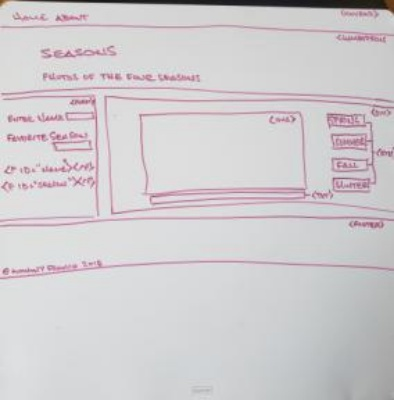

# Journal for Homework 2

## What are we doing?

This week we are to build a webpage (or use the one from homework 1) that uses Javascript and jQuery. Since it has been awhile that I have used Javascript, I decided to take a [tutorial](https://www.w3schools.com/Js/) at w3schools.com so I could remember exactly how it works. Once I started going through the tutorial, I remembered quite a bit of it. jQuery is a language I was unfamiliar with, so again I turned to an online [tutorial](https://www.w3schools.com/jquery/default.asp) to learn how it works. I found jQuery easy to understand and got me thinking about how and where to use it on my webpage. For this project, I will build a separate webpage and not use homework 1 webpage.

## Webpage

The webpage I am creating will contain text-boxes, radio buttons, and a card that will contain a photo area and button to move through pictures of your favorite season. There is also a temperature converter so the user can enter a number to convert and select the radio button to return the selected temperature reading type.
The page will look something like: 

## Javascript

The items which will need Javascript code in order to capture input, choices, and other actions from the user include:
    * The navbar menu item will have a hover event which will change the color of "Menu" when the cursor is on the item
    * Form1 will have a name and season input and a button to move input to a function 
        / The name will be returned to the screen inside a welcome message
        / The season input will be used to select the pictures that match the input
    * Form2 is part of the temperature converter which includes radio buttons, an input box, and a submit button
    be converted.
        / Radio buttons are to select fahrenheit or celsius
        / The input box accepts user input and returns the converted temperature according to the radio button selected
        / The select button will be used to send input and selection to a function
    * The card will display pictures that match the season selected by the user
        / A clickon event will occur when the picture is clicked-on which advances through selected photos matching selection
        / Text, which displays the credits to the source and photographer of the photo, will be displayed in the bottom section of the card
        
I wrote out a "script list" before beginning the code:

