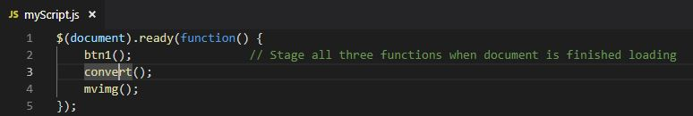
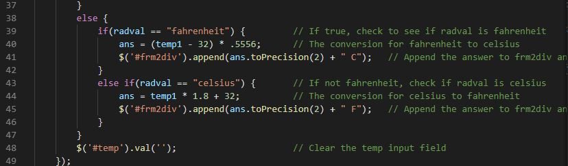
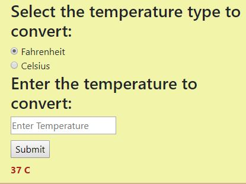

# Journal for Homework 2

## What are we doing?

This week we are to build a webpage (or use the one from homework 1) that uses Javascript and jQuery. Since it has been awhile that I have used Javascript, I decided to take a [tutorial](https://www.w3schools.com/Js/) at w3schools.com so I could remember exactly how it works. Once I started going through the tutorial, I remembered quite a bit of it. jQuery is a language I was unfamiliar with, so again I turned to an online [tutorial](https://www.w3schools.com/jquery/default.asp) to learn how it works. I found jQuery easy to understand and got me thinking about how and where to use it on my webpage. For this project, I will build a separate webpage and not use homework 1 webpage.

## Webpage

The webpage I am creating will contain text-boxes, radio buttons, and a card that will contain a photo area and button to move through pictures of your favorite season. There is also a temperature converter so the user can enter a number to convert and select the radio button to return the selected temperature reading type.
The page will look something like: 

## Javascript

The items which will need Javascript code in order to capture input, choices, and other actions from the user include:
  * The navbar menu item will have a hover event which will change the color of "Menu" when the cursor is on the item
  * Form1 will have a name and season input and a button to move input to a function
  
     / The name will be returned to the screen inside a welcome message
     
     / The season input will be used to select the pictures that match the input
     
  * Form2 is part of the temperature converter which includes radio buttons, an input box, and a submit button
    be converted.
    
     / Radio buttons are to select fahrenheit or celsius
     
     / The input box accepts user input and returns the converted temperature to the webpage according to the radio button selected
     
     / The select button will be used to send input and selection to a function
     
  * The card will display pictures that match the season selected by the user
  
     / A clickon event will occur when the picture is clicked-on which advances through selected photos matching selection
     
     / Text, which displays the credits to the source and photographer of the photo, will be displayed in the bottom section of the card
        
I wrote out a "script list" before beginning the code:

## Coding

Coding was a nightmare this time around. Not the webpage code, but learning how to get values in jQuery and learning how to apply those values was tough. I still need to figure out how to set my pictures up to go through the selection after entering the season. That input should be a drop-down, but I had to leave it for now and move on before getting completely shutout on turning in the link. I've watched numerous youTube videos on different subjects because the text wasn't getting through my thick skull. So, here is the run-down on my code.

### HTML

We were told to put the jQuery stuff at the bottom of the page that caused the first of many issues that I needed to research. I kept getting errors when loading the page, and they were errors that I never have seen before. It was in the jQuery library and when researching the error, I found out that jQuery had to be loaded before Bootstrap. So, I moved everything to the bottom of the page which left the head section looking pretty skimpy:

This is the bottom of the page:

I liked the way the navbar and jumbotron look together, so I used both these elements again. For the form, I used a col-md-4 div and on the same row, I used a col-md-8 div to hold the card which contains a picture on the top half and text on the bottom half. I'm still working on writing the code so the user can go through pictures and text of their season of choice. Here is some of that code:

The next section is the temperature converter that allows the user to enter a number and receive the temperature in the opposite reading. The default selection of the radio buttons is fahrenheit, but the user is able to select celsius and get the fahrenheit equivilent of the temperature they would like to convert. The code for this section is:

### jQuery

Before I attemped to write any jQuery code, I went through a couple online tutorials and thought, "this will be easy enough". Boy, was I wrong. I absolutely understand the things that you can do with jQuery, but for some reason, I just couldn't get the code part of it to work from a separate file. I had `` tags on the top of the page, like I thought I was supposed to but the errors told me I was wrong. Then, I tried `$(document).ready(function{ });` with some functions inside of it, but it didn't like that either. I really was beside myself why this wasn't working. I know I had the correct link on the `index.html` page, but why? WHY WON'T IT WORK!!!!! At one point to prove to myself that the code I wrote actually worked, I added it to the `index.html` page and sure enough it worked. Yet again, more research only to find that I really was close to getting it to work. FINALLY!!!!! I got the link to work. The `$(document).ready(function{ });` at the top of the page was correct, and I put the functions I wrote outside of the function then added the functions to the `.ready(function{ });`.

After getting the pages to link, the first form which takes the user's name and their favorite season input to return this information within a welcome statement. I wanted the textboxes to reset after the button was clicked to clear the data from them. Since I was having trouble with jQuery, I wrote the code in Javascript to make sure I was getting the values from the input after the button was clicked. The values were correct, but the code was not jQuery. Back to researching. Once I got some code together that actually worked, I was able to find some fixes for the things that were irritating me. The button object will continue to print out data which was pretty annoying. I found `.one();` to solve that problem. This is the `btn1()` code:

Although not perfect, it will return the inputs in the welcome script. I still want to make the `#season` input a dropdown and link the season to a list of images pertaining to the selected season. The images will be advanced by clicking on the image. I'm hoping to finish this part of the project.

The conversion section was a little easier to code, but I still needed to figure out how to get the value of a radio button and compare it to a `string` for the `if` statement. The value being returned was `undefined` and not what I wanted or needed to keep the code running. Looking through example after example I found `$('input:radio[name=temperature]:checked').val();` which returned exactly what I wanted. From there, I set up a check to make sure that the data entered was numeric, and if it isn't, it will return an `alert();` to inform the user that the data entered was not a number. Code:

Once the numeric checked is passed, it will drop down to be evaluated again. This time the radio button is checked to select the correct conversion formula to use. Then, the result will be displayed on screen below the button and the input box will be cleared. 

