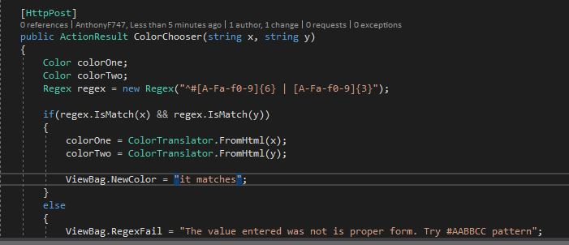

# Journal for Homework 4

Well, I'm totally down on myself for this week's project. We are learning ASP.NET MVC 5, and I thought that I was doing so well until...I messed something up and have to recreate my project. I'm going to make the best of this situation and take snapshots as I go since I didn't do this the first time around. 

The `Converter`, which is where the page will accept a number (which is the number of miles to convert) from the user and convert that number to one of four metric types: millimeters, centimeters, meters, and kilometers. I previously had this working properly using `razor` but when I merged the work with the master, all the code was gone. It all reverted back to `HTML` that I used to build the original pages. When I spoke to Dr. Morse one day after class, I sounded like all the code was be in `razor`, but I was incorrect. I used a separate branch to create the `Converter` and didn't push to a master and that is more than likely the reason for the code not merging properly. I'm still trying to figure this out, but with nine hours to turn this project in, I don't have time to troubleshoot many issues. So, here we go building a new project from the beginning.

Here is a portion of the first commit:

This is how the new project looks when it is created:

The web view of the new project:

After changing the `_Layout.cshtml` page, I recoded the `Index.cshtml` page to get the required start page.

The new start page:

In the next step, I created a new `Converter` controller in the `Home` controller.

The `Converter` view code to set up radio buttons and textbox:

Here is the `Converter` view:

After adding input to `Converter`:

I was having issues with getting a tooltip stlye alert to work if a `string` or `char` is entered into the miles textbox, so I added a ViewBag that displays a message if a number is not entered.

The next thing I did was add the `ColorController` and configured the route.

I'm trying to figure out the `ColorTranslator` and `System.Drawing` to get the colors, but haven't figured it out yet. In this image, I'm trying to verify if the input is in the hexidecimal pattern as shown on the view page.

