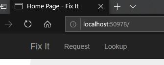
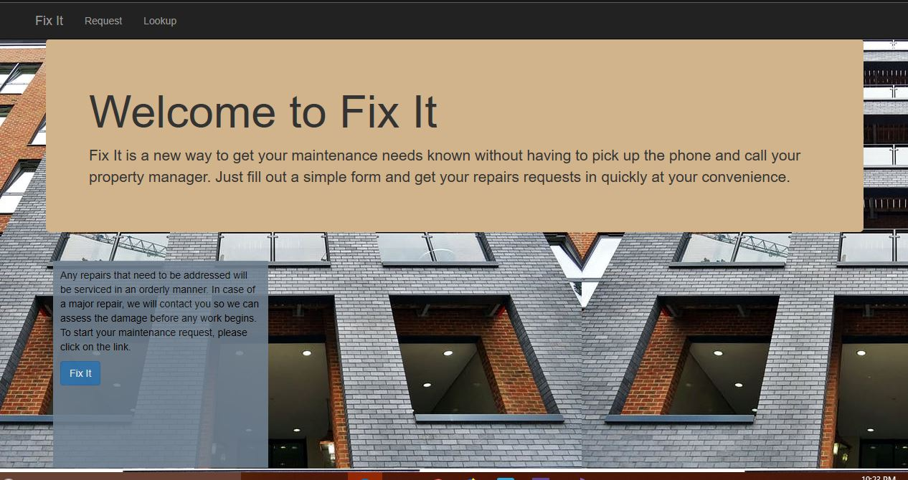
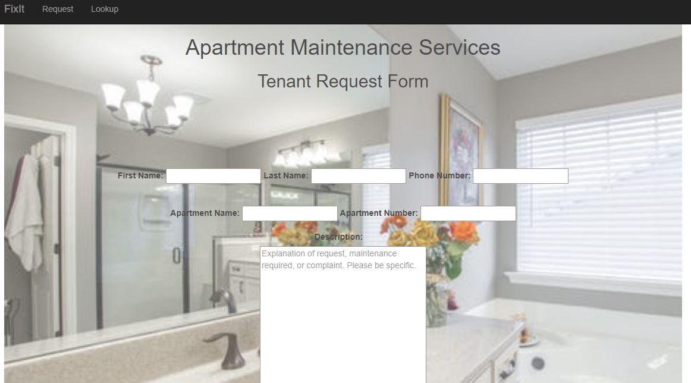

# Journal for Homework 5

Ok, after 4 weeks, I decided to start the journal and add to it as I go because trying to recreate stuff later has been like playing catch-up at the end of the week. 

Since my failure with getting the button, on week 4's ColorChooser view, to find the post method in the ColorController, I'm hoping that working with a model might solve some of the confusion. I'm almost positive that we need to put something in the .gitignore to make certain items in this project to be in the GitHub repository while other items are not included. This might be a question rather than research.

Well, here we go with the project. 

This project has us creating a maintenance form for an apartment/rental environment. When a tenant has a maintenance issue, the tenant fills out the online form and submits it for management or the maintenance person to handle the request. The application will have a database that stores the information entered on the form which includes the tenant's name, apartment number, and maintenance required.

After loading and committing project 5, I changed the shared nav-bar to new links. I decided to go with "Fix It" as my apps name. The two other links will be a "request" link to the maintenance form for tenants to fill out when they have a maintenance issue, and the last page will be for the maintenance/management personnel to get information from the database.

The current nav-bar looks like: 

I worked on the `Index.cshtml` landing page. It took a while to figure out how to get a background picture for the page, but I did it YAY!! I'm not thrilled with the `div` that has the button to the `Request` page, but it will do for this project.

Landing page:

The code was simple:

    

            

            <h1>Welcome to Fix It</h1>
            

                Fix It is a new way to get your maintenance needs known without having to
                pick up the phone and call your property manager. Just fill out a simple 
                form and get your repairs requests in quickly at your convenience.

        

        

            

                

                    
<bold>
                        Any repairs that need to be addressed will be serviced
                        in an orderly manner. In case of a major repair, we will
                        contact you so we can assess the damage before any work
                        begins. To start your maintenance request, please click on
                        the link.
                    </bold>

                    @Html.ActionLink("Fix It", "Request", "Request", new { @class = "btn btn-primary" })
                

            

        

    

    
Adding the background picture to the body:

    body {
        background-image: url(../Content/images/apartmentpic.jpg);
        width: 100%;
        height: auto;
        padding-top: 50px;
        padding-bottom: 20px;
    }
    
In order to get the background image, I had to create an image folder in the `Content` folder and add the image to it. Then,
I added a new bundle so the image would be found in that folder:

        bundles.Add(new ScriptBundle("~/bundles/css").Include(
                      "~/Content/css/Site.css",
                      new CssRewriteUrlTransform()
                  ));
                  
The source stated that this code will link to locale paths. I guess it worked because the picture finally showed up on the page.
    
Style for the button `div`:

    .request-btn {
        width: 300px !important;
        height: 289px !important;
        color: black;
        background-color: slategray;
        padding: 10px;
        margin: 10px;
        text-align: center center;
        opacity: 0.9;
    }

Since we are supposed to use different branches to show how we can figure that out, I used a branch called "design" for building the landing page and getting the view set up. I switched branches to "model" and created the "Project5.Models" page that holds the getters and setters for the database.

Now to tackle the model portion of the project. This didn't take too long:

     namespace Project5.Models
      {
        public class Tenants
        {
            public int ID { get; set; }

            [Required(ErrorMessage = "Please enter your first name")]
            [StringLength (20)]
            public string FirstName { get; set; }

            [Required(ErrorMessage = "Please enter your last name")]
            [StringLength (25)]
            public string LastName { get; set; }

            [Required(ErrorMessage = "Please enter your phone number")]
            [StringLength (10)]
            public string PhoneNumber { get; set; }

            [Required(ErrorMessage = "Please enter your apartment name")]
            [StringLength (30)]
            public string ApartmentName { get; set; }

            [Required(ErrorMessage = "Please enter your unit number")]
            public int ApartmentNumber { get; set; }

            [Required(ErrorMessage = "Please enter a short description of the issue")]
            [StringLength (500)]
            public string Description { get; set; }
            
            public bool IsHome { get; set; }
        }
    }
    
I put required on everything except for the `Description` portion. I'll probably add a `Required` validation to force the user to
input a short description of the maintenance issue. The management/maintenance personnel should know what kind of repair is needed.

Oh no, when I woke up this morning, I logged on to create the form on the "Request" page. As always, I do a `git status` command to make sure that everything is still good to go and to my surprise, there was something that needed to be added and committed. I don't know where or why this showed up because I made sure to do all this before powering down my machine for the night. I worked on the form and went to go test the page to see how the layout was coming along and... 404 popped up and wouldn't load at all. I don't know if the commit I made first thing this morning has anything to do with it since it was a `.csproj` extension. At least I wasn't too far into the project and I can have it back to where I was shortly. This is such an inconvenience!

You think you've seen it all and then something changes your mind. During the rebuild of project 5, I set the `background-image` to the picture and it worked first time out. I didn't have to add a new bundle as in the previous build. Can anyone explain this to me? I couldn't get that dumb picture to show until I added that bundle and this time it displayed the picture. I'm stumped!!!

    
The view for `TenantView` is complete but needs some work. I'm running into `.css` issues which are mainly my fault. I don't know why my `textarea` won't scale the way I want it to, but it's really annoying. I have to move on...

Here is the view:

The code to build the view:

    @model Project5.Models.Tenants

    @{
        ViewBag.Title = "TenantView";
    }

    

        

            <h1 id="tenhead">Apartment Maintenance Services</h1>

        <h2 id="tensub">Tenant Request Form</h2>
    

    @using (Html.BeginForm())
    {
        @Html.ValidationSummary()
        

            

                @Html.Label("First Name:")
                @Html.TextBoxFor(x => x.FirstName)
                @Html.Label("Last Name:")
                @Html.TextBoxFor(x => x.LastName)
                @Html.Label("Phone Number:")
                @Html.TextBoxFor(x => x.PhoneNumber)
            

        

        

            

                @Html.Label("Apartment Name:")
                @Html.TextBoxFor(x => x.ApartmentName)
                @Html.Label("Apartment Number:")
                @Html.TextBoxFor(x => x.ApartmentNumber)
            

        

        @Html.Label("Description:", new { style = "color: black" })
        

            @Html.TextAreaFor(x => x.Description, new { style="width: 500px; height: 400px;", placeholder="Explanation" +
            " of request, maintenance required, or complaint. Please be specific."})
        

        @Html.ActionLink("Submit", "TenantView", "Home", new { @class = "btn btn-primary btn-lg" })
    }
    

