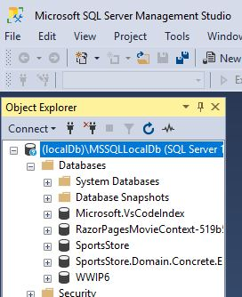
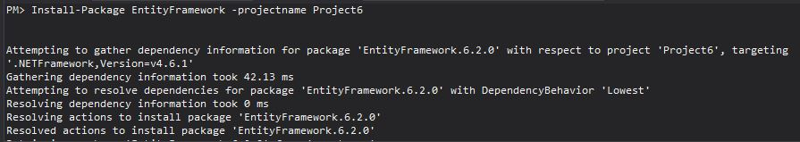
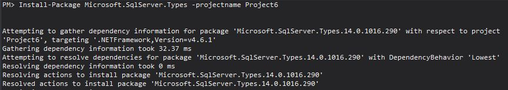

# Journal for Homework 6

Well, we have arrived to week 6. The pace is fast, and I don't think I have fully completed the assignments since week 3. I am trying to get a majority of the work complete before moving on to the next project. I'm proud of myself for figuring out the database and getting data in and out of it on the last day I was going to work on Project5 before starting Project6, so maybe I'll be able to figure this out with that discovery. Here we go...

I loaded Project 6 and added the database using SQL Manager:

Then, I loaded the Entity Framework package:

Next, I loaded the Microsoft.SqlServer.Types package:

