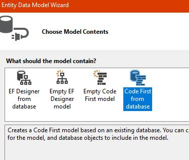
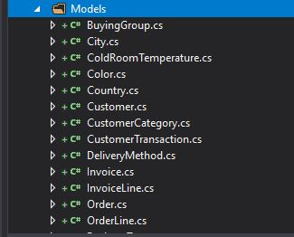
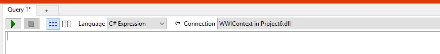

# Journal for Homework 6

Well, we have arrived to week 6. The pace is fast, and I don't think I have fully completed the assignments since week 3. I am trying to get a majority of the work complete before moving on to the next project. I'm proud of myself for figuring out the database and getting data in and out of it on the last day I was going to work on Project5 before starting Project6, so maybe I'll be able to figure this out with that discovery. Here we go...

I loaded Project 6 and added the database using SQL Manager:

Then, I loaded the Entity Framework package:

Next, I loaded the Microsoft.SqlServer.Types package:

The next step adds a couple lines of code to the global.asax.cs file to connect with SqlServerTypes:

    protected void Application_Start()
        {
            // For Spatial types, i.e. DbGeography
            SqlServerTypes.Utilities.LoadNativeAssemblies(Server.MapPath("~/bin"));

            // Fix from https://stackoverflow.com/questions/13174197/microsoft-sqlserver-types-version-10-or-higher-could-not-be-found-on-azure/40166192#40166192
            SqlProviderServices.SqlServerTypesAssemblyName = typeof(SqlGeography).Assembly.FullName;

            AreaRegistration.RegisterAllAreas();
            FilterConfig.RegisterGlobalFilters(GlobalFilters.Filters);
            RouteConfig.RegisterRoutes(RouteTable.Routes);
            BundleConfig.RegisterBundles(BundleTable.Bundles);
        }
      }
    }
    
The ADO gets added next:

With Manuel's help, I got Linqpad downloaded and linked to the database. The problem was that I was looking for the database name for the link and not the project name. Also, the dropdown on the top toolbar has to have the database selected in order for the link to work.

I created a view for returning information for the person being searched for:

    public class DisplayPerson
    {
        public string FullName { get; set; }
        public string PreferredName { get; set; }
        public string PhoneNumber { get; set; }
        public string FaxNumber { get; set; }
        public string EmailAddress { get; set; }
        public DateTime ValidFrom { get; set; }
        public byte Photo { get; set; }

        public override string ToString()
        {
            return $"{base.ToString()}: {FullName} {PreferredName} {PhoneNumber} {FaxNumber} {EmailAddress} {ValidFrom} {Photo}";
        }
    }
    }
    
I don't know what this is?

    λ git add .
    warning: LF will be replaced by CRLF in hw6/Project6/Project6/Project6/Content/bootstrap-theme.css.
    The file will have its original line endings in your working directory
    warning: LF will be replaced by CRLF in hw6/Project6/Project6/Project6/Content/bootstrap-theme.min.css.
    The file will have its original line endings in your working directory
    warning: LF will be replaced by CRLF in hw6/Project6/Project6/Project6/Content/bootstrap.css.
    The file will have its original line endings in your working directory
    warning: LF will be replaced by CRLF in hw6/Project6/Project6/Project6/Content/bootstrap.min.css.
    The file will have its original line endings in your working directory
    warning: LF will be replaced by CRLF in hw6/Project6/Project6/Project6/Scripts/bootstrap.js.
    The file will have its original line endings in your working directory
    warning: LF will be replaced by CRLF in hw6/Project6/Project6/Project6/Scripts/bootstrap.min.js.
    The file will have its original line endings in your working directory
    warning: LF will be replaced by CRLF in hw6/Project6/Project6/Project6/Scripts/jquery-3.3.1.js.
    The file will have its original line endings in your working directory
    warning: LF will be replaced by CRLF in hw6/Project6/Project6/Project6/Scripts/jquery-3.3.1.min.js.
    The file will have its original line endings in your working directory
    warning: LF will be replaced by CRLF in hw6/Project6/Project6/Project6/Scripts/jquery-3.3.1.slim.js.
    The file will have its original line endings in your working directory
    warning: LF will be replaced by CRLF in hw6/Project6/Project6/Project6/Scripts/jquery-3.3.1.slim.min.js.
    The file will have its original line endings in your working directory
    warning: LF will be replaced by CRLF in hw6/Project6/Project6/Project6/Scripts/jquery.validate.js.
    The file will have its original line endings in your working directory
    warning: LF will be replaced by CRLF in hw6/Project6/Project6/Project6/Scripts/jquery.validate.min.js.
    The file will have its original line endings in your working directory
    warning: LF will be replaced by CRLF in hw6/Project6/Project6/Project6/Scripts/jquery.validate.unobtrusive.min.js.
    The file will have its original line endings in your working directory
    warning: LF will be replaced by CRLF in hw6/Project6/Project6/Project6/Scripts/modernizr-2.8.3.js.
    The file will have its original line endings in your working directory
    warning: LF will be replaced by CRLF in hw6/Project6/Project6/Project6/fonts/glyphicons-halflings-regular.svg.
    The file will have its original line endings in your working directory

    C:\Users\anthony\gitStuff\Gitpage (master -> origin)
  
Ok, I have officially given up on this project. The next project is due in a couple days and I have yet to start it, so I will let Project 6 go for now and maybe I'll understand what is actually going on one day. Total epic failure. 

