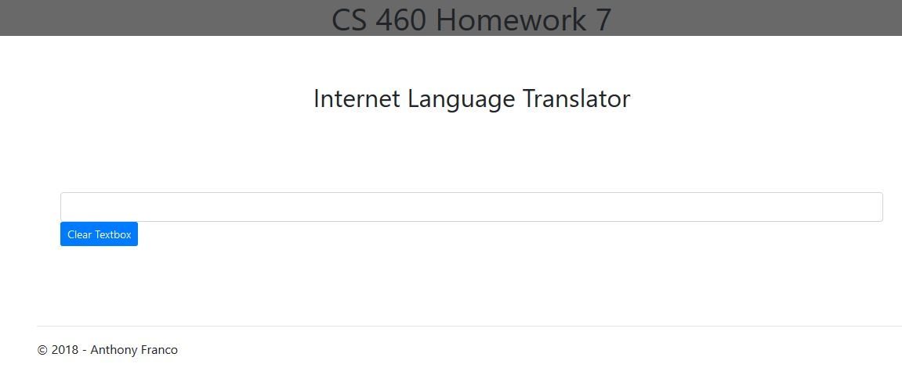
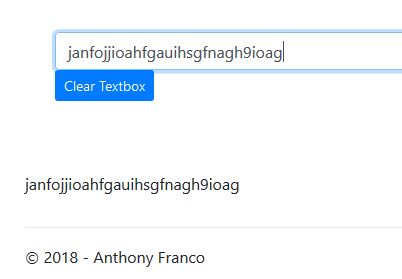
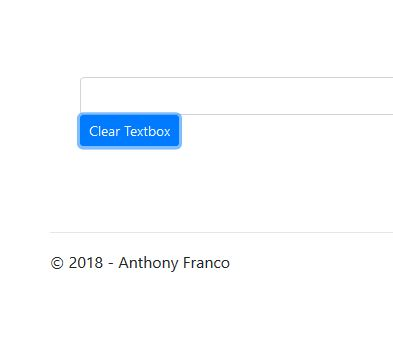

# Homework 7 Journal

This assignment has us using Giphy to bring data in from an outside source using APIs. Routing will be handled with custom routing tables. 

We are to start with an empty project and build off of that. I added a layout page which contains bootstrap, jquery, javascript, and a link to MyScripts.js which contain my code to run the language translator page. My controller is 'APIController' and the routing page was changed accordingly so the controller was found upon loading the page.

Here is the layout code:

    <!DOCTYPE html>
    <html>
        <head>
    <meta charset="utf-8" />
    <meta name="viewport" content="width=device-width, initial-scale=1.0">
    <title>@ViewBag.Title - Internet Language Translator</title>
    <link href="~/Content/Site.css" rel="stylesheet" type="text/css" />
    <link href="~/Content/bootstrap.min.css" rel="stylesheet" type="text/css" />
    
    
    @RenderSection("Javascript", required: false)

    </head>
    <body>
    

        

            <h1>CS 460 Homework 7</h1>
        

    

    

        @RenderBody()
        

        <footer>
            
&copy; @DateTime.Now.Year - Anthony Franco

        </footer>
    

    
    
    </body>
    </html>
    
The index page: 

    @{
    ViewBag.Title = "Index";
    }

    

    

        <h2>Internet Language Translator</h2>
    

    

        

            
                <label for="textbox"></label>
                <input class="form-control" type="text" id="textbox" />
                <button class="btn btn-primary btn-sm" type="reset" id="clearsrn">Clear Textbox</button>
            
        

    

    

        

    

    

    @section Javascript
    {
    
    }

The routing table at this point:

    public class RouteConfig
    {
        public static void RegisterRoutes(RouteCollection routes)
        {
            routes.IgnoreRoute("{resource}.axd/{*pathInfo}");

            routes.MapRoute(
                name: "Default",
                url: "{controller}/{action}/{id}",
                defaults: new { controller = "API", action = "Index", id = UrlParameter.Optional }
            );
        }
        
The current state of the controller:

    namespace Project7.Controllers
        {
    public class APIController : Controller
    {
        // GET: API
        public ActionResult Index()
        {
            return View();
        }
    }
    }
    
MyScripts.js file currently, includes duplicating text to a div and a clear button that clears both areas:

    $(document).ready(function () {
    $("input")
        .keyup(function () {
            var value = $(this).val();
            $("#ptxt").text(value);
        })
        .keyup();
    cleardiv();
    });

    function cleardiv() {
    $("button").click(function () {
        $("#resultrow").empty();
        $("#textbox").val('');
    });
    }
    
This is what the landing page looks like:

When inputing text in the textbox, the text will appear in a div below the textbox in real-time:

After clicking the 'Clear Textbox' button:

