#Journal for Homework 8

After the last two homework assignments, I'm glad I have some basic knowledge of how to get the website and database going. I also got the controllers and crud items for each table item from the database. Joy at last. Here are some highlights of this assignment.

Class diagram for the database:

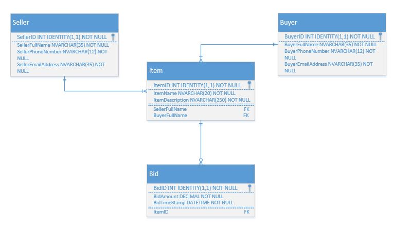

The Seller and Buyer classes have a 1 to many relationship with the Item class since a seller or buyer can sale or buy many items, and the Item class has a 1 to many relationship with the Bid class since an item can have many bids.

The database wasn't that difficult to set up along with a basic up/down script: 

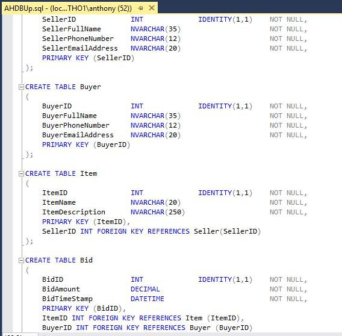

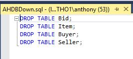

Next, I created the landing page. I'm sorry I didn't quite do the Reginald Auction House, but I thought my idea was humorous. It's faster for me to think of silly things to put in an auction house then the items posted in Reginald's site.

The landing page:

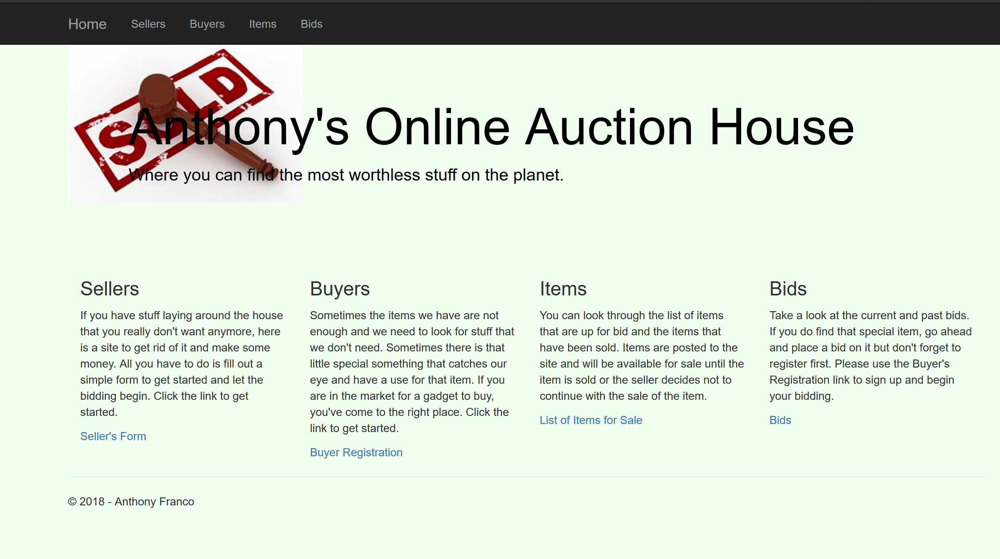

The code for the landing page:

    @{
    ViewBag.Title = "Home Index";
    }

    

    

        <h1>Anthony's Online Auction House</h1>
        

            Where you can find the most worthless stuff
            on the planet.
        

    

    

    

    

        

            

                

                    <h3 class="card-title">Sellers</h3>
                    

                        If you have stuff laying around the house that you really don't
                        want anymore, here is a site to get rid of it and make some money.
                        All you have to do is fill out a simple form to get started and
                        let the bidding begin. Click the link to get started.
                    

                    <a href="/Home/CheckName" class="card-link">Seller's Form</a>
                

            

        

        

            

                

                    <h3 class="card-title">Buyers</h3>
                    

                        Sometimes the items we have are not enough and we need to look for
                        stuff that we don't need. Sometimes there is that little special
                        something that catches our eye and have a use for that item. If you
                        are in the market for a gadget to buy, you've come to the right place.
                        Click the link to get started.
                    

                    <a href="/Home/CheckBuyer" class="card-link">Buyer Registration</a>
                

            

        

        

            

                

                    <h3 class="card-title">Items</h3>
                    

                        You can look through the list of items that are up for bid and the
                        items that have been sold. Items are posted to the site and will be
                        available for sale until the item is sold or the seller decides not
                        to continue with the sale of the item.
                    

                    <a href="/Items/Index" class="card-link">List of Items for Sale</a>
                

            

        

        

            

                

                    <h3 class="card-title">Bids</h3>
                    

                        Take a look at the current and past bids. If you do find that special
                        item, go ahead and place a bid on it but don't forget to register first.
                        Please use the Buyer's Registration link to sign up and begin your bidding.
                    

                    <a href="/Bids/Index" class="card-link">Bids</a>
                

            

        

    

    

    
At the top of the landing page, there is a navbar with 5 elements. The first is the "Home" link which takes a user back to the landing page. The next four links will display the list of database entries for that specific element, such as a list of sellers in the database. I used scaffolding when building the controllers and views for the tables elements and have removed most of the links except for the details link. 

I did adjust this code a little to somewhat match up with the requirement. The phone number check is something I wanted to implement so the database was being used by all classes.

The landing page contains four card elements for seller, buyer, item, and bid. When a user comes on to the webpage and wants to buy or sell an item, they will click on the link at the bottom of the appropriate card and be taken to a check account page. On this page, the user will be prompted to enter their phone number to determine if they have bought or sold on the site previously. If they have not, the user is redirected to enter their full name, phone number, and email address in order to post an item or post a bid for an item. 

Here is the check account page:

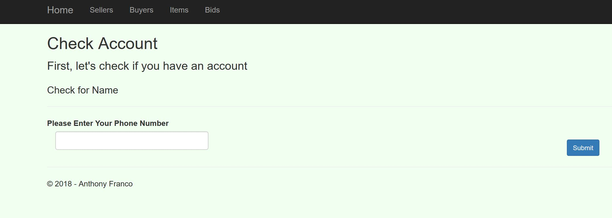

Here is the code for the checkAccountView:

    @{
    ViewBag.Title = "CheckName";
    }

    <h2>Check Account</h2>
    
First, let's check if you have an account

    @using (Html.BeginForm())
    {
    @Html.AntiForgeryToken()

    

        <h4>Check for Name</h4>
        

        @Html.ValidationSummary(true, "", new { @class = "text-danger" })
    

    

        @Html.Label("Please Enter Your Phone Number")
        

            @Html.TextBox("phoneNumber", null, new { @class = "form-control" })
        

    

    <button class="btn btn-primary btn-sm" type="submit">Submit</button>
    }
    

The seller and buyer both have the matching pages:

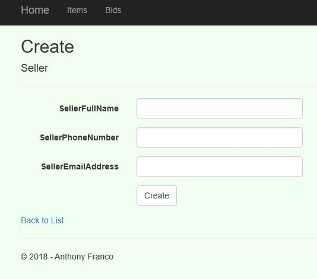

Here is adding a seller to the database:

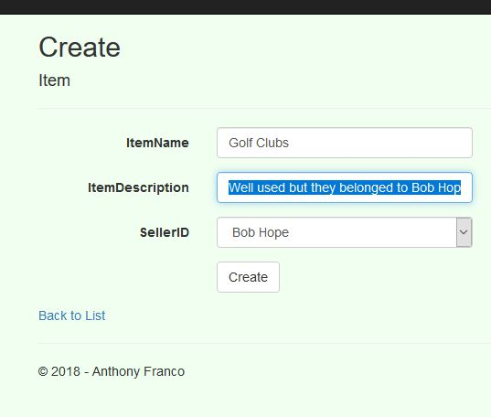

After submitting the form:

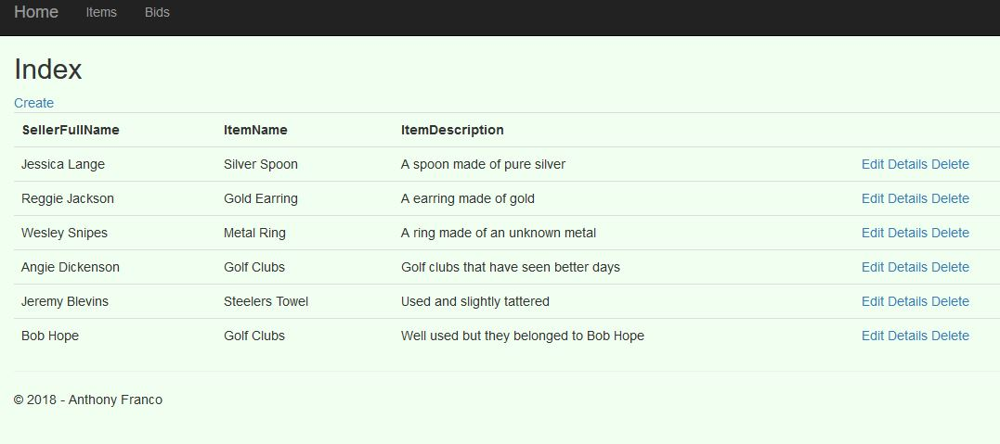

Now the new item is in the database and so is the seller. If the seller was in the database already, the seller will be taken directly to the Items/Create page. The buyer works the same, so if the buyer is in the database, the redirect action takes them to the /Bids/Create page. 

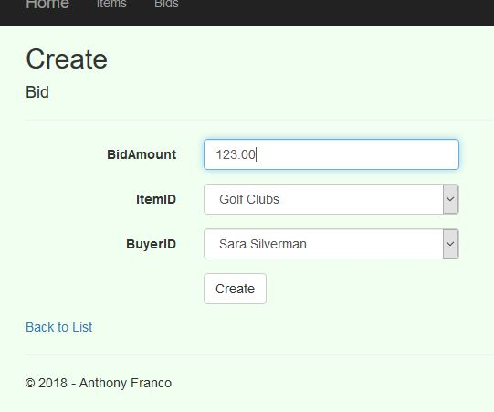

After entering the bid:

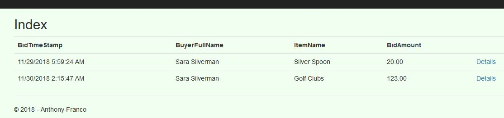

I wish I had more time with the Ajax and JSON stuff because I really don't understand how it works. I know what I'm doing over winter break.

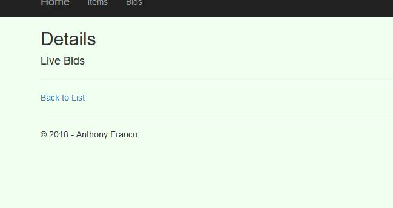

Obviously, it's not working but I hope to figure something out before Scot grades my project. If I don't get to it, I'll be working on understanding why so I know what's going on next term.

[json](https://www.w3schools.com/js/js_json_arrays.asp)

[json2](https://www.w3schools.com/js/js_json_html.asp)

[ajax](https://www.w3schools.com/js/js_ajax_xmlfile.asp)

[jquery](https://www.w3schools.com/jquery/default.asp)

[jquery](https://learn.jquery.com/ajax/key-concepts/)

[jquerymethods](https://learn.jquery.com/ajax/jquery-ajax-methods/)

[ajaxjson](https://www.javatpoint.com/ajax-json-example)

[mozillaajax](https://developer.mozilla.org/en-US/docs/Web/Guide/AJAX/Getting_Started)

[ajax](https://webdesign.tutsplus.com/tutorials/a-beginners-guide-to-ajax-with-jquery--cms-25126)

[mozillajson](https://developer.mozilla.org/en-US/docs/Learn/JavaScript/Objects/JSON)

[microsoftjson](https://msdn.microsoft.com/en-us/library/bb299886.aspx)

