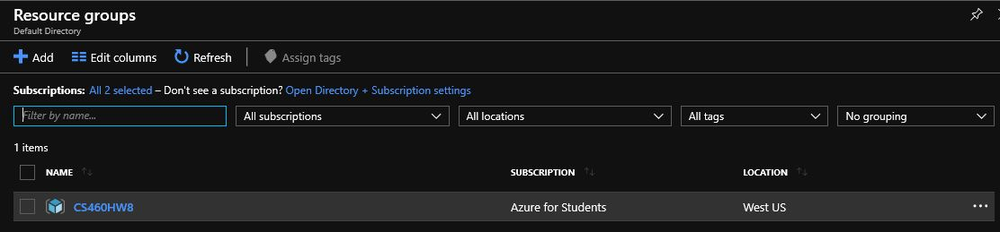
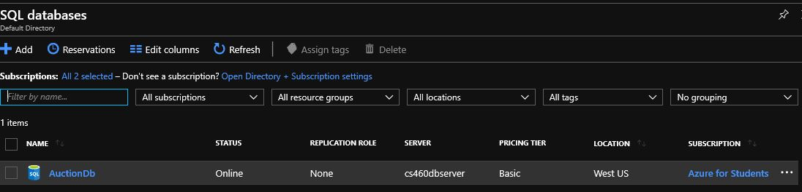
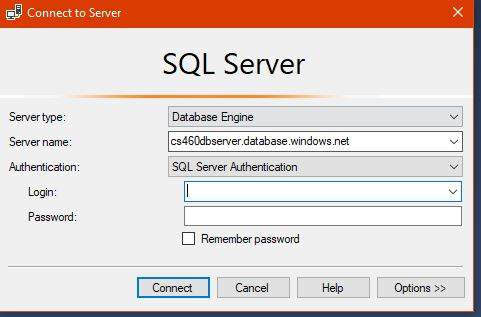
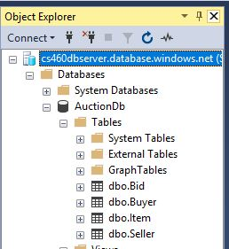
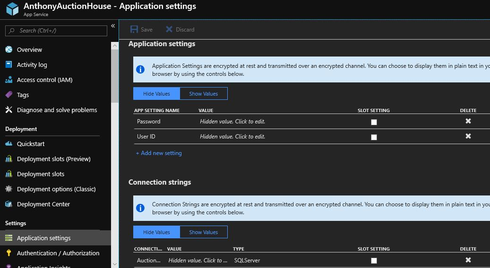
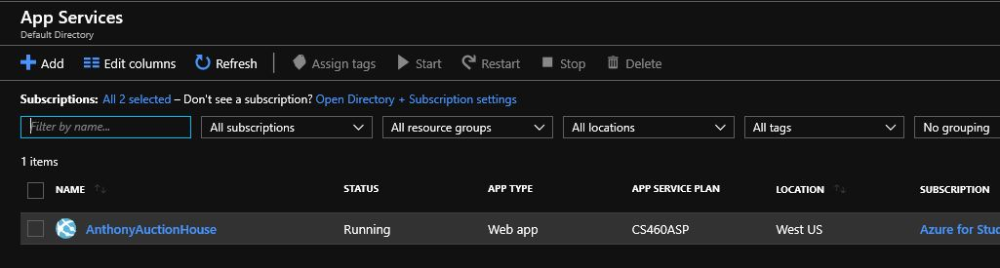
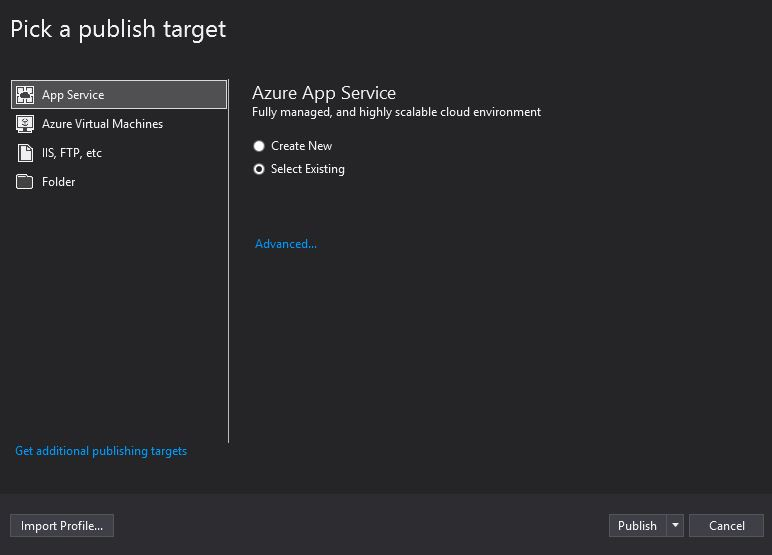
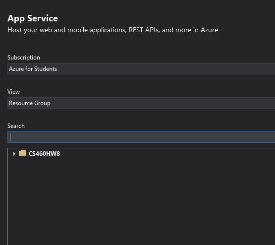
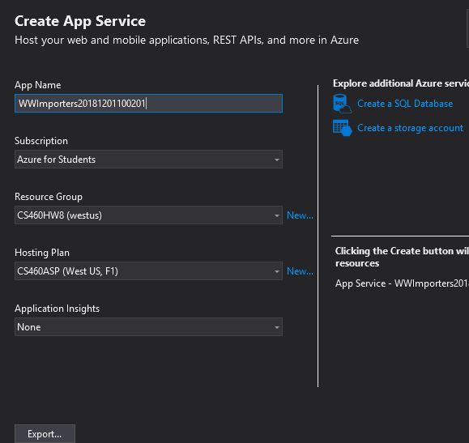

# Journal for Homework 9

This is the last journal for Software Engineering I. For this assignment, we are to deploy the project from homework 8 to Azure. I followed the video Scot posted and it was pretty simple, but I did encounter one issue along the way. Scot was on Slack, so I was able to send a snap of the error message I received which resulted in a sign-off/sign-on to rectify the issue. 

I'll try to recreate the steps to set up Azure for project deployment since I wasn't smart enough to do it when I was going through the steps.

The first step is to create a resource group:

I called mine CS460HW8 since it will be used for homework 8. Next is to set up the database and server. The server option is given during creation of the database.

Next, set a firewall rule for the server. Access the server through the resource group and go to firewall and virtual machine:

Set the firewall to the IP address shown on the page and give it a name. Don't forget to hit the save button to save this information. 

The next steps involve SQL Server Managerment Studio. When signing on to the database, you have to change the server name to the server name the database provides for the connection.

Don't forget to fill in the username and password to connect to the database.

The connection string needs to be set up in the web_config file in Visual Studio project and also in the application settings for the project on Azure. To get the connection string, go to the Azure database and click the connection string link. This connection string can be copied to paste into the appropriate places. Don't push to github with the username/password combination because you will get nasty letters from Azure/GitHub telling you that the information is out there for everyone to see, so be sure to "X" them out before pushing to github. The name of the connection string is the same as the dbcontext name used in the project and select sql server as what is being used.

After setting the connection strings, create a web app on Azure. This will not have the project in it but will be a shell to add the project.

The finishing touches include building the project and publishing it to Azure. Click the publish button and select existing group if using a group that already exists in Azure.

If you add a new project:

I didn't quite understand the part about clicking something to keep the app_data stuff from being deployed, so I guess I will look for that checkbox. Otherwise, these steps should deploy the project to Azure.