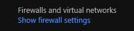

# Journal for Homework 9

This is the last journal for Software Engineering I. For this assignment, we are to deploy the project from homework 8 to Azure. I followed the video Scot posted and it was pretty simple, but I did encounter one issue along the way. Scot was on Slack, so I was able to send a snap of the error message I received which resulted in a sign-off/sign-on to rectify the issue. 

I'll try to recreate the steps to set up Azure for project deployment since I wasn't smart enough to do it when I was going through the steps.

The first step is to create a resource group:

I called mine CS460HW8 since it will be used for homework 8. Next is to set up the database and server. The server option is given during creation of the database.

Next, set a firewall rule for the server. Access the server through the resource group and go to firewall and virtual machine:

Set the firewall to the IP address shown on the page and give it a name. Don't forget to hit the save button to save this information. 

The next steps involve SQL Server Managerment Studio. When signing on to the database, you have to change the server name to the server name the database provides for the connection.

Don't forget to fill in the username and password to connect to the database.

